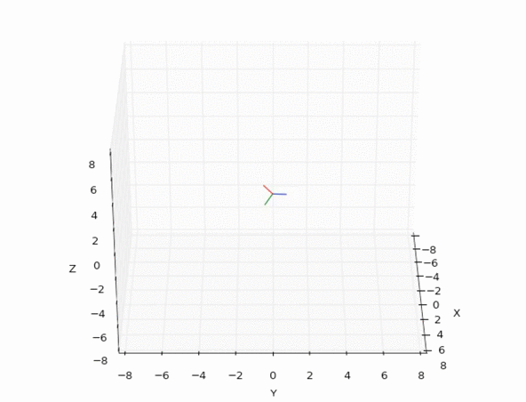

# pyquaternion
---

A fully featured python module for quaternion representation, manipulation, 3D rotation and animation.

Please visit the **[pyquaternion homepage](http://kieranwynn.github.io/pyquaternion/)** for full information and the latest documentation.

**Designed for Python 2.7+ and 3.0+**

> Smooth animation with interpolation between random orientations using the pyquaternion module.

